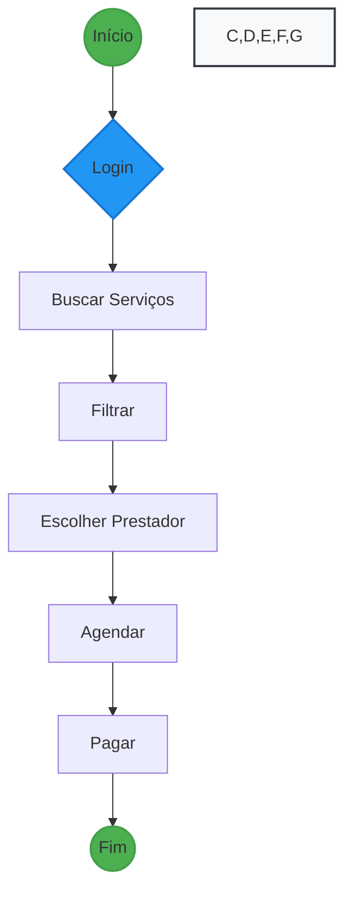

# MyServ - Professional Services Booking Platform


## 📋 Descrição

MyServ é um plugin WordPress desenvolvido para criar uma plataforma completa de agendamento de serviços profissionais. Perfeito para prestadores de serviços que precisam gerenciar agendamentos, pagamentos e comunicação com clientes.

### 🌟 Principais Funcionalidades

- Gestão completa de agendamentos
- Integração com MercadoPago
- Notificações via WhatsApp (ChatPro)
- Sistema de geolocalização
- Perfis de prestadores de serviços
- Gestão de clientes
- Sistema de avaliações
- Relatórios e métricas

## 🛠️ Requisitos

- WordPress 6.0 ou superior
- PHP 7.4 ou superior
- MySQL 5.7 ou superior
- Extensão PHP cURL ativada
- SSL ativo no site (necessário para pagamentos)

## 📦 Instalação

1. Faça o upload da pasta `myserv-plugin` para o diretório `/wp-content/plugins/`
2. Ative o plugin através do menu 'Plugins' no WordPress
3. Configure as credenciais do MercadoPago em 'MyServ > Configurações > Pagamentos'
4. Configure as credenciais do ChatPro em 'MyServ > Configurações > Notificações'
5. Configure as chaves da API do Google Maps em 'MyServ > Configurações > Localização'

## ⚙️ Configuração

### Configurações Gerais

1. **Pagamentos (MercadoPago)**
   - Access Token
   - Public Key
   - Moeda padrão
   - Taxas de serviço

2. **Notificações (WhatsApp)**
   - API Key do ChatPro
   - Mensagens padrão
   - Configuração de lembretes

3. **Localização**
   - Chave API do Google Maps
   - Raio de busca padrão
   - Unidade de distância

### Tipos de Usuário

1. **Administrador**
   - Acesso total ao sistema
   - Gerenciamento de usuários
   - Configurações do plugin

2. **Prestador de Serviços**
   - Gerenciamento de serviços
   - Controle de agenda
   - Visualização de reservas
   - Relatórios básicos

3. **Cliente**
   - Busca de serviços
   - Agendamentos
   - Histórico de reservas
   - Avaliações

## 💼 Funcionalidades Detalhadas

### Gestão de Serviços

- Cadastro de serviços com:
  - Título e descrição
  - Preços
  - Duração
  - Categorias
  - Localização
  - Fotos
  - Horários disponíveis

### Sistema de Reservas

- Processo de reserva intuitivo
- Verificação de disponibilidade em tempo real
- Confirmação automática ou manual
- Pagamento online
- Notificações automáticas

### Pagamentos

- Integração completa com MercadoPago
- Suporte a diferentes métodos de pagamento
- Gestão de reembolsos
- Relatórios financeiros
- Sistema de taxas configurável

### Notificações

- Confirmação de agendamento
- Lembretes automáticos
- Alterações de status
- Confirmação de pagamento
- Mensagens personalizáveis

### Geolocalização

- Busca por proximidade
- Mapa interativo
- Cálculo de distância
- Filtro por região

## 📊 Hooks e Filtros

### Actions

```php
// Novo agendamento
do_action('myserv_booking_created', $booking_id);

// Alteração de status
do_action('myserv_booking_status_changed', $booking_id, $status);

// Pagamento confirmado
do_action('myserv_payment_completed', $booking_id, $payment_data);
```

### Filters

```php
// Personalizar mensagens WhatsApp
apply_filters('myserv_whatsapp_message', $message, $type);

// Modificar critérios de busca
apply_filters('myserv_search_criteria', $args);

// Ajustar taxas de serviço
apply_filters('myserv_service_fee', $fee, $booking_id);
```

## 🔧 API REST

O plugin expõe endpoints REST para integração com outros sistemas:

```
GET /wp-json/myserv/v1/services
GET /wp-json/myserv/v1/providers
POST /wp-json/myserv/v1/bookings
PATCH /wp-json/myserv/v1/bookings/{id}
```

## 📱 Shortcodes Disponíveis

```
[myserv_search] - Formulário de busca
[myserv_calendar] - Calendário de disponibilidade
[myserv_provider_profile] - Perfil do prestador
[myserv_booking_form] - Formulário de agendamento
```

## 🌐 Internacionalização

- Suporte completo a traduções
- Arquivos .pot incluídos
- Traduções disponíveis:
  - Português (BR)
  - Inglês
  - Espanhol

## 🤝 Suporte

- Documentação: [link]
- Suporte: support@myserv.com
- Bug Reports: [GitHub Issues]

## 📄 Licença

Este plugin está licenciado sob a GPL v2 ou posterior.

## 👥 Contribuindo

1. Fork o projeto
2. Crie sua Feature Branch (`git checkout -b feature/AmazingFeature`)
3. Commit suas mudanças (`git commit -m 'Add some AmazingFeature'`)
4. Push para a Branch (`git push origin feature/AmazingFeature`)
5. Abra um Pull Request

## 🗓️ Changelog

### 1.0.0
- Lançamento inicial
- Sistema básico de agendamentos
- Integração MercadoPago
- Notificações WhatsApp
- Geolocalização

## ✨ Próximas Atualizações

- [ ] App mobile
- [ ] Sistema de fidelidade
- [ ] Integrações com calendários externos
- [ ] Mais opções de gateway de pagamento
- [ ] Sistema de comissionamento

## 📈 Fluxo do Usuário



## 📊 Fluxo Administrativo

```mermaid
graph TD
    A((Admin)) --> B[Painel]
    B --> C[Gerenciar Serviços]
    B --> D[Gerenciar Reservas]
    B --> E[Relatórios]
    B --> F[Configurações]

    style A fill:#dc3545,stroke:#c82333,stroke-width:2px
    style B,C,D,E,F fill:#f8f9fa,stroke:#343a40,stroke-width:2px
    B --> C[Agenda]
    C --> D[Reservas]
    D --> E[Pagamentos]
    E --> F[Relatórios]
    C --> D[Buscar Serviços]
    D --> E[Filtrar por:<br>- Localização<br>- Categoria<br>- Preço]
    E --> F[Visualizar Perfil do Prestador]
    F --> G[Verificar Disponibilidade]
    G --> H[Selecionar Data/Hora]
    H --> I[Criar Reserva]
    I --> J[Processo de Pagamento<br>via MercadoPago]
    J --> K{Status Pagamento}
    K -->|Aprovado| L[Receber Confirmação<br>via WhatsApp]
    K -->|Rejeitado| M[Notificação de Falha<br>Tentar Novamente]
    L --> N[Acompanhar Status<br>da Reserva]
    N --> O[Receber Lembretes<br>via WhatsApp]
    O --> P[Serviço Realizado]
    P --> Q[Avaliar Serviço]

    %% Fluxo do Administrador/Prestador
    B -->|Administrador/Prestador| R[Painel Administrativo]
    R --> S[Gerenciar Serviços]
    S --> T[Criar/Editar Serviços:<br>- Título<br>- Descrição<br>- Preço<br>- Categoria<br>- Localização]
    
    R --> U[Gerenciar Reservas]
    U --> V[Visualizar Lista de<br>Reservas Pendentes]
    V --> W[Confirmar/Rejeitar<br>Reservas]
    W --> X[Atualizar Status:<br>- Pendente<br>- Confirmado<br>- Cancelado<br>- Concluído]
    
    R --> Y[Gerenciar Pagamentos]
    Y --> Z[Visualizar Transações]
    Z --> AA[Processar Reembolsos]
    
    R --> BB[Configurações]
    BB --> CC[Configurar:<br>- Horários Disponíveis<br>- Notificações<br>- Integração MercadoPago<br>- Integração WhatsApp]
    
    R --> DD[Relatórios]
    DD --> EE[Visualizar:<br>- Reservas por Período<br>- Faturamento<br>- Avaliações<br>- Métricas de Desempenho]

    %% Subprocessos
    I --> FF[Subprocesso: Notificações]
    FF --> GG[Notificar Prestador<br>Nova Reserva]
    FF --> HH[Notificar Cliente<br>Status da Reserva]
    FF --> II[Enviar Lembretes<br>Automáticos]

    %% Processo de Pagamento
    J --> JJ[Subprocesso: Pagamento]
    JJ --> KK[Criar Preferência<br>MercadoPago]
    KK --> LL[Processar Pagamento]
    LL --> MM[Atualizar Status<br>da Reserva]
    MM --> NN[Gerar Comprovante]
    
    %% Estilização
    classDef cliente fill:#0077b6,stroke:#023e8a,stroke-width:2px,color:#fff,font-weight:bold
    classDef admin fill:#d00000,stroke:#6a040f,stroke-width:2px,color:#fff,font-weight:bold
    classDef processo fill:#38b000,stroke:#006400,stroke-width:2px,color:#fff,font-weight:bold
    classDef decisao fill:#faa307,stroke:#bc6c25,stroke-width:2px,color:#000,font-weight:bold

    %% Aplicar Estilos
    class C,D,E,F,G,H,I,L,M,N,O,P,Q cliente
    class R,S,T,U,V,W,X,Y,Z,AA,BB,CC,DD,EE admin```

## 💫 Sistema de Notificações

```mermaid
graph LR
    A((Reserva)) --> B{WhatsApp}
    B --> C[Cliente]
    B --> D[Prestador]
    C --> E[Lembretes]
    D --> F[Status]

    style A fill:#4CAF50,stroke:#45a049,stroke-width:2px
    style B fill:#2196F3,stroke:#1976D2,stroke-width:2px
    style C,D,E,F fill:#f8f9fa,stroke:#343a40,stroke-width:2px
```
```
